# Entity Relationship Diagram (ERD)
## MightyDNS - Database Schema Design

**Version:** 1.0
**Last Updated:** 2025-10-22
**Status:** Draft

---

## 1. Design Principles

### 1.1 Normalization
All tables follow **Third Normal Form (3NF)**:
- **1NF:** Atomic values, no repeating groups
- **2NF:** No partial dependencies (all non-key attributes depend on entire primary key)
- **3NF:** No transitive dependencies (non-key attributes depend only on primary key)

### 1.2 Naming Conventions
- **Tables:** `<entity>_<type>` (snake_case, 2+ words)
- **Columns:** `<descriptor>_<attribute>` (snake_case, 2+ words)
- **Indexes:** `idx_<table>_<column(s)>`
- **Foreign Keys:** `fk_<table>_<referenced_table>`
- **Unique Constraints:** `uq_<table>_<column(s)>`

### 1.3 Partitioning Strategy
- **Hash Partitioning:** On `tenant_id` (1024 partitions) for tenant-scoped tables
- **Range Partitioning:** On `timestamp` columns for time-series data
- **Dynamic Expansion:** pg_cron jobs create new partitions automatically

### 1.4 Reusable Database Objects

```sql
-- Custom domains for validation
CREATE DOMAIN email_address AS VARCHAR(255)
    CHECK (VALUE ~* '^[A-Za-z0-9._%+-]+@[A-Za-z0-9.-]+\.[A-Za-z]{2,}$');

CREATE DOMAIN dns_domain_name AS VARCHAR(253)
    CHECK (VALUE ~* '^([a-z0-9-]+\.)*[a-z0-9-]+$' OR VALUE = '*');

CREATE DOMAIN ipv4_address AS INET
    CHECK (family(VALUE) = 4);

CREATE DOMAIN ipv6_address AS INET
    CHECK (family(VALUE) = 6);

CREATE DOMAIN uuid_identifier AS UUID
    DEFAULT gen_random_uuid();

-- Common timestamp composite type
CREATE TYPE timestamp_metadata AS (
    created_at TIMESTAMPTZ,
    updated_at TIMESTAMPTZ,
    deleted_at TIMESTAMPTZ
);

-- Subscription tier enum
CREATE TYPE subscription_tier_enum AS ENUM ('free', 'pro', 'family', 'business');

-- Subscription status enum
CREATE TYPE subscription_status_enum AS ENUM ('active', 'expired', 'cancelled', 'suspended');

-- Authentication credential type enum
CREATE TYPE credential_type_enum AS ENUM ('fido2', 'totp', 'email_otp');

-- DNS query result type enum
CREATE TYPE dns_result_type_enum AS ENUM ('allowed', 'blocked', 'whitelisted', 'error');

-- DNS query type enum (common record types)
CREATE TYPE dns_query_type_enum AS ENUM ('A', 'AAAA', 'CNAME', 'MX', 'TXT', 'NS', 'SOA', 'PTR', 'SRV');

-- Block category enum
CREATE TYPE block_category_enum AS ENUM (
    'advertising',
    'malware_phishing',
    'adult_content',
    'gambling_betting',
    'social_media',
    'streaming_media',
    'tracking_telemetry',
    'cryptomining',
    'piracy_torrents',
    'custom_user'
);
```

---

## 2. Core Entities

### 2.1 Entity List

| Entity | Purpose | Partitioning | Estimated Rows |
|--------|---------|--------------|----------------|
| `tenant_account` | User accounts | Hash (tenant_id) | 10M |
| `tenant_subscription` | Subscription billing info | Hash (tenant_id) | 10M |
| `tenant_config` | DNS filtering configurations | Hash (tenant_id) | 50M (5 configs/tenant avg) |
| `tenant_device` | Device identification | Hash (tenant_id) | 100M (10 devices/tenant) |
| `tenant_ip_binding` | IP → Tenant mapping for UDP/53 | Hash (tenant_id) | 10M |
| `auth_credential` | FIDO2/TOTP/Email OTP credentials | Hash (tenant_id) | 20M (2 methods/tenant) |
| `auth_session` | Active JWT sessions | Hash (tenant_id) | 10M |
| `auth_otp_challenge` | Temporary OTP codes | - (Redis alternative) | 100K (short-lived) |
| `block_list_entry` | Global blocklist domains | Hash (block_domain_name) | 50M+ domains |
| `block_list_source` | External blocklist sources | - | 100 sources |
| `white_list_entry` | Per-tenant whitelists | Hash (tenant_id) | 10M |
| `dns_query_log` | DNS query history | Range (query_timestamp) | 10B+ (time-series) |
| `analytics_hourly_summary` | Pre-aggregated analytics | Range (hour_timestamp) | 100M |
| `analytics_daily_summary` | Daily rollups | Range (day_date) | 10M |
| `payment_transaction` | Payment history | Hash (tenant_id) | 10M |
| `audit_log_entry` | Security audit trail | Range (log_timestamp) | 100M |

---

## 3. Entity Relationship Diagram

### 3.1 Core Schema (Mermaid)

```mermaid
erDiagram
    tenant_account ||--o{ tenant_subscription : "has"
    tenant_account ||--o{ tenant_config : "has"
    tenant_account ||--o{ tenant_device : "has"
    tenant_account ||--o{ tenant_ip_binding : "has"
    tenant_account ||--o{ auth_credential : "has"
    tenant_account ||--o{ auth_session : "has"
    tenant_account ||--o{ white_list_entry : "has"
    tenant_account ||--o{ dns_query_log : "generates"
    tenant_account ||--o{ analytics_hourly_summary : "has"
    tenant_account ||--o{ payment_transaction : "has"
    tenant_account ||--o{ audit_log_entry : "generates"

    tenant_config ||--o{ config_block_category : "has"
    tenant_config ||--o{ config_custom_domain : "has"

    block_list_source ||--o{ block_list_entry : "provides"

    tenant_account {
        uuid tenant_id PK
        email_address email_address UK
        varchar tenant_identifier UK
        subscription_tier_enum subscription_tier
        subscription_status_enum subscription_status
        timestamptz account_created_at
        timestamptz account_updated_at
        boolean is_account_active
    }

    tenant_subscription {
        uuid subscription_id PK
        uuid tenant_id FK
        varchar lemon_squeezy_subscription_id UK
        varchar lemon_squeezy_customer_id
        subscription_tier_enum subscription_tier
        subscription_status_enum subscription_status
        timestamptz subscription_started_at
        timestamptz subscription_expires_at
        timestamptz subscription_cancelled_at
        integer monthly_query_limit
        integer config_limit
        boolean is_subscription_active
    }

    tenant_config {
        uuid config_id PK
        uuid tenant_id FK
        varchar config_name
        text config_description
        boolean is_logging_enabled
        boolean is_dnssec_enabled
        varchar blocked_response_ip
        timestamptz config_created_at
        timestamptz config_updated_at
        boolean is_config_active
    }

    tenant_device {
        uuid device_id PK
        uuid tenant_id FK
        uuid config_id FK
        varchar device_name
        varchar device_type
        varchar device_identifier
        timestamptz device_registered_at
        timestamptz device_last_seen_at
        boolean is_device_active
    }

    tenant_ip_binding {
        uuid binding_id PK
        uuid tenant_id FK
        uuid config_id FK
        inet ip_address UK
        varchar ip_description
        timestamptz binding_created_at
        timestamptz binding_expires_at
        boolean is_binding_active
    }

    auth_credential {
        uuid credential_id PK
        uuid tenant_id FK
        credential_type_enum credential_type
        bytea credential_public_key
        bigint credential_counter
        varchar totp_secret_key
        varchar credential_name
        timestamptz credential_created_at
        timestamptz credential_last_used_at
        boolean is_credential_active
    }

    auth_session {
        uuid session_id PK
        uuid tenant_id FK
        varchar session_token_hash UK
        inet session_ip_address
        varchar session_user_agent
        timestamptz session_created_at
        timestamptz session_expires_at
        timestamptz session_last_activity_at
        boolean is_session_active
    }

    block_list_source {
        uuid source_id PK
        varchar source_name UK
        varchar source_url
        varchar source_format
        block_category_enum source_category
        timestamptz source_last_updated_at
        boolean is_source_active
    }

    block_list_entry {
        bigserial block_entry_id PK
        dns_domain_name block_domain_name UK
        uuid source_id FK
        block_category_enum block_category
        varchar block_reason
        timestamptz block_added_at
        timestamptz block_updated_at
        boolean is_block_active
    }

    white_list_entry {
        uuid white_entry_id PK
        uuid tenant_id FK
        dns_domain_name white_domain_name
        varchar white_reason
        timestamptz white_added_at
        boolean is_white_active
    }

    config_block_category {
        uuid config_category_id PK
        uuid config_id FK
        block_category_enum block_category
        boolean is_category_enabled
    }

    config_custom_domain {
        uuid custom_domain_id PK
        uuid config_id FK
        dns_domain_name custom_domain_name
        varchar custom_domain_action
        timestamptz custom_domain_added_at
        boolean is_custom_active
    }

    dns_query_log {
        bigserial query_id PK
        uuid tenant_id FK
        uuid config_id FK
        timestamptz query_timestamp
        dns_domain_name query_domain_name
        dns_query_type_enum query_type
        dns_result_type_enum query_result_type
        inet response_ip_address
        smallint query_latency_ms
        varchar query_source_protocol
    }

    analytics_hourly_summary {
        uuid summary_id PK
        uuid tenant_id FK
        timestamptz hour_timestamp
        bigint total_query_count
        bigint blocked_query_count
        bigint whitelisted_query_count
        jsonb top_blocked_domains
        jsonb top_allowed_domains
        smallint avg_query_latency_ms
    }

    analytics_daily_summary {
        uuid summary_id PK
        uuid tenant_id FK
        date day_date
        bigint total_query_count
        bigint blocked_query_count
        bigint whitelisted_query_count
        jsonb category_breakdown
        jsonb device_breakdown
    }

    payment_transaction {
        uuid transaction_id PK
        uuid tenant_id FK
        varchar lemon_squeezy_order_id UK
        varchar transaction_type
        decimal transaction_amount
        varchar transaction_currency
        varchar transaction_status
        timestamptz transaction_created_at
        jsonb transaction_metadata
    }

    audit_log_entry {
        bigserial log_id PK
        uuid tenant_id FK
        varchar log_action
        varchar log_resource
        jsonb log_metadata
        inet log_ip_address
        varchar log_user_agent
        timestamptz log_timestamp
    }
```



---

## 4. Table Definitions (SQL)

### 4.1 Tenant Account Table

```sql
CREATE TABLE tenant_account (
    tenant_id uuid_identifier PRIMARY KEY,
    email_address email_address UNIQUE NOT NULL,
    tenant_identifier VARCHAR(32) UNIQUE NOT NULL, -- For DoH/DoT URLs (e.g., "abc123")
    subscription_tier subscription_tier_enum DEFAULT 'free' NOT NULL,
    subscription_status subscription_status_enum DEFAULT 'active' NOT NULL,
    account_created_at TIMESTAMPTZ DEFAULT NOW() NOT NULL,
    account_updated_at TIMESTAMPTZ DEFAULT NOW() NOT NULL,
    is_account_active BOOLEAN DEFAULT TRUE NOT NULL,

    CONSTRAINT chk_tenant_identifier_format CHECK (tenant_identifier ~* '^[a-z0-9]{8,32}$')
) PARTITION BY HASH (tenant_id);

-- Create 1024 partitions for horizontal scaling
DO $$
DECLARE
    partition_num INTEGER;
BEGIN
    FOR partition_num IN 0..1023 LOOP
        EXECUTE format(
            'CREATE TABLE tenant_account_%s PARTITION OF tenant_account FOR VALUES WITH (MODULUS 1024, REMAINDER %s)',
            partition_num, partition_num
        );
    END LOOP;
END $$;

-- Indexes
CREATE INDEX idx_tenant_account_email ON tenant_account (email_address);
CREATE INDEX idx_tenant_account_identifier ON tenant_account (tenant_identifier);
CREATE INDEX idx_tenant_account_subscription ON tenant_account (subscription_tier, subscription_status)
    WHERE is_account_active = TRUE;

-- Trigger to update account_updated_at
CREATE TRIGGER trg_tenant_account_updated
    BEFORE UPDATE ON tenant_account
    FOR EACH ROW
    EXECUTE FUNCTION update_timestamp_column();
```

### 4.2 Tenant Subscription Table

```sql
CREATE TABLE tenant_subscription (
    subscription_id uuid_identifier PRIMARY KEY,
    tenant_id UUID NOT NULL,
    lemon_squeezy_subscription_id VARCHAR(100) UNIQUE,
    lemon_squeezy_customer_id VARCHAR(100),
    subscription_tier subscription_tier_enum NOT NULL,
    subscription_status subscription_status_enum DEFAULT 'active' NOT NULL,
    subscription_started_at TIMESTAMPTZ DEFAULT NOW() NOT NULL,
    subscription_expires_at TIMESTAMPTZ,
    subscription_cancelled_at TIMESTAMPTZ,
    monthly_query_limit BIGINT,
    config_limit INTEGER DEFAULT 1,
    subscription_metadata JSONB,
    is_subscription_active BOOLEAN DEFAULT TRUE NOT NULL,

    CONSTRAINT fk_tenant_subscription_tenant
        FOREIGN KEY (tenant_id) REFERENCES tenant_account(tenant_id) ON DELETE CASCADE,
    CONSTRAINT chk_subscription_dates
        CHECK (subscription_expires_at IS NULL OR subscription_expires_at > subscription_started_at)
) PARTITION BY HASH (tenant_id);

-- Create partitions
DO $$
DECLARE
    partition_num INTEGER;
BEGIN
    FOR partition_num IN 0..1023 LOOP
        EXECUTE format(
            'CREATE TABLE tenant_subscription_%s PARTITION OF tenant_subscription FOR VALUES WITH (MODULUS 1024, REMAINDER %s)',
            partition_num, partition_num
        );
    END LOOP;
END $$;

-- Indexes
CREATE INDEX idx_tenant_subscription_tenant ON tenant_subscription (tenant_id);
CREATE INDEX idx_tenant_subscription_lemon ON tenant_subscription (lemon_squeezy_subscription_id);
CREATE INDEX idx_tenant_subscription_status ON tenant_subscription (subscription_status, subscription_expires_at)
    WHERE is_subscription_active = TRUE;
```

### 4.3 Tenant Config Table

```sql
CREATE TABLE tenant_config (
    config_id uuid_identifier PRIMARY KEY,
    tenant_id UUID NOT NULL,
    config_name VARCHAR(100) NOT NULL,
    config_description TEXT,
    is_logging_enabled BOOLEAN DEFAULT TRUE NOT NULL,
    is_dnssec_enabled BOOLEAN DEFAULT TRUE NOT NULL,
    blocked_response_ip INET DEFAULT '0.0.0.0'::inet, -- IP to return for blocked domains
    config_created_at TIMESTAMPTZ DEFAULT NOW() NOT NULL,
    config_updated_at TIMESTAMPTZ DEFAULT NOW() NOT NULL,
    is_config_active BOOLEAN DEFAULT TRUE NOT NULL,

    CONSTRAINT fk_tenant_config_tenant
        FOREIGN KEY (tenant_id) REFERENCES tenant_account(tenant_id) ON DELETE CASCADE,
    CONSTRAINT uq_tenant_config_name
        UNIQUE (tenant_id, config_name)
) PARTITION BY HASH (tenant_id);

-- Create partitions
DO $$
DECLARE
    partition_num INTEGER;
BEGIN
    FOR partition_num IN 0..1023 LOOP
        EXECUTE format(
            'CREATE TABLE tenant_config_%s PARTITION OF tenant_config FOR VALUES WITH (MODULUS 1024, REMAINDER %s)',
            partition_num, partition_num
        );
    END LOOP;
END $$;

-- Indexes
CREATE INDEX idx_tenant_config_tenant ON tenant_config (tenant_id);
CREATE INDEX idx_tenant_config_active ON tenant_config (tenant_id, is_config_active);
```

### 4.4 Config Block Category Table (3NF - Many-to-Many)

```sql
CREATE TABLE config_block_category (
    config_category_id uuid_identifier PRIMARY KEY,
    config_id UUID NOT NULL,
    block_category block_category_enum NOT NULL,
    is_category_enabled BOOLEAN DEFAULT TRUE NOT NULL,
    category_updated_at TIMESTAMPTZ DEFAULT NOW() NOT NULL,

    CONSTRAINT fk_config_block_category_config
        FOREIGN KEY (config_id) REFERENCES tenant_config(config_id) ON DELETE CASCADE,
    CONSTRAINT uq_config_category
        UNIQUE (config_id, block_category)
) PARTITION BY HASH (config_id);

-- Create partitions
DO $$
DECLARE
    partition_num INTEGER;
BEGIN
    FOR partition_num IN 0..1023 LOOP
        EXECUTE format(
            'CREATE TABLE config_block_category_%s PARTITION OF config_block_category FOR VALUES WITH (MODULUS 1024, REMAINDER %s)',
            partition_num, partition_num
        );
    END LOOP;
END $$;

-- Indexes
CREATE INDEX idx_config_block_category_config ON config_block_category (config_id);
CREATE INDEX idx_config_block_category_enabled ON config_block_category (config_id, is_category_enabled);
```

### 4.5 Config Custom Domain Table (3NF)

```sql
CREATE TABLE config_custom_domain (
    custom_domain_id uuid_identifier PRIMARY KEY,
    config_id UUID NOT NULL,
    custom_domain_name dns_domain_name NOT NULL,
    custom_domain_action VARCHAR(20) DEFAULT 'block' CHECK (custom_domain_action IN ('block', 'allow')),
    custom_domain_added_at TIMESTAMPTZ DEFAULT NOW() NOT NULL,
    is_custom_active BOOLEAN DEFAULT TRUE NOT NULL,

    CONSTRAINT fk_config_custom_domain_config
        FOREIGN KEY (config_id) REFERENCES tenant_config(config_id) ON DELETE CASCADE,
    CONSTRAINT uq_config_custom_domain
        UNIQUE (config_id, custom_domain_name)
) PARTITION BY HASH (config_id);

-- Create partitions
DO $$
DECLARE
    partition_num INTEGER;
BEGIN
    FOR partition_num IN 0..1023 LOOP
        EXECUTE format(
            'CREATE TABLE config_custom_domain_%s PARTITION OF config_custom_domain FOR VALUES WITH (MODULUS 1024, REMAINDER %s)',
            partition_num, partition_num
        );
    END LOOP;
END $$;

-- Indexes
CREATE INDEX idx_config_custom_domain_config ON config_custom_domain (config_id);
CREATE INDEX idx_config_custom_domain_name ON config_custom_domain (custom_domain_name);
```

### 4.6 Tenant IP Binding Table

```sql
CREATE TABLE tenant_ip_binding (
    binding_id uuid_identifier PRIMARY KEY,
    tenant_id UUID NOT NULL,
    config_id UUID NOT NULL,
    ip_address INET UNIQUE NOT NULL,
    ip_description VARCHAR(255),
    binding_created_at TIMESTAMPTZ DEFAULT NOW() NOT NULL,
    binding_expires_at TIMESTAMPTZ,
    is_binding_active BOOLEAN DEFAULT TRUE NOT NULL,

    CONSTRAINT fk_tenant_ip_binding_tenant
        FOREIGN KEY (tenant_id) REFERENCES tenant_account(tenant_id) ON DELETE CASCADE,
    CONSTRAINT fk_tenant_ip_binding_config
        FOREIGN KEY (config_id) REFERENCES tenant_config(config_id) ON DELETE CASCADE
) PARTITION BY HASH (tenant_id);

-- Create partitions
DO $$
DECLARE
    partition_num INTEGER;
BEGIN
    FOR partition_num IN 0..1023 LOOP
        EXECUTE format(
            'CREATE TABLE tenant_ip_binding_%s PARTITION OF tenant_ip_binding FOR VALUES WITH (MODULUS 1024, REMAINDER %s)',
            partition_num, partition_num
        );
    END LOOP;
END $$;

-- Indexes
CREATE INDEX idx_tenant_ip_binding_tenant ON tenant_ip_binding (tenant_id);
CREATE INDEX idx_tenant_ip_binding_ip ON tenant_ip_binding (ip_address) WHERE is_binding_active = TRUE;
CREATE INDEX idx_tenant_ip_binding_expires ON tenant_ip_binding (binding_expires_at)
    WHERE binding_expires_at IS NOT NULL AND is_binding_active = TRUE;
```

### 4.7 Authentication Credential Table

```sql
CREATE TABLE auth_credential (
    credential_id uuid_identifier PRIMARY KEY,
    tenant_id UUID NOT NULL,
    credential_type credential_type_enum NOT NULL,
    credential_public_key BYTEA, -- For FIDO2 (serialized public key)
    credential_counter BIGINT DEFAULT 0, -- For FIDO2 replay protection
    totp_secret_key VARCHAR(64), -- Base32-encoded secret
    credential_name VARCHAR(100), -- User-friendly name (e.g., "YubiKey", "iPhone")
    credential_created_at TIMESTAMPTZ DEFAULT NOW() NOT NULL,
    credential_last_used_at TIMESTAMPTZ,
    is_credential_active BOOLEAN DEFAULT TRUE NOT NULL,

    CONSTRAINT fk_auth_credential_tenant
        FOREIGN KEY (tenant_id) REFERENCES tenant_account(tenant_id) ON DELETE CASCADE,
    CONSTRAINT chk_fido2_required_fields
        CHECK (credential_type != 'fido2' OR (credential_public_key IS NOT NULL AND credential_counter IS NOT NULL)),
    CONSTRAINT chk_totp_required_fields
        CHECK (credential_type != 'totp' OR totp_secret_key IS NOT NULL)
) PARTITION BY HASH (tenant_id);

-- Create partitions
DO $$
DECLARE
    partition_num INTEGER;
BEGIN
    FOR partition_num IN 0..1023 LOOP
        EXECUTE format(
            'CREATE TABLE auth_credential_%s PARTITION OF auth_credential FOR VALUES WITH (MODULUS 1024, REMAINDER %s)',
            partition_num, partition_num
        );
    END LOOP;
END $$;

-- Indexes
CREATE INDEX idx_auth_credential_tenant ON auth_credential (tenant_id);
CREATE INDEX idx_auth_credential_type ON auth_credential (tenant_id, credential_type)
    WHERE is_credential_active = TRUE;
```

### 4.8 Authentication Session Table

```sql
CREATE TABLE auth_session (
    session_id uuid_identifier PRIMARY KEY,
    tenant_id UUID NOT NULL,
    session_token_hash VARCHAR(64) UNIQUE NOT NULL, -- SHA-256 hash of JWT
    session_ip_address INET NOT NULL,
    session_user_agent TEXT,
    session_created_at TIMESTAMPTZ DEFAULT NOW() NOT NULL,
    session_expires_at TIMESTAMPTZ NOT NULL,
    session_last_activity_at TIMESTAMPTZ DEFAULT NOW() NOT NULL,
    is_session_active BOOLEAN DEFAULT TRUE NOT NULL,

    CONSTRAINT fk_auth_session_tenant
        FOREIGN KEY (tenant_id) REFERENCES tenant_account(tenant_id) ON DELETE CASCADE,
    CONSTRAINT chk_session_expiry
        CHECK (session_expires_at > session_created_at)
) PARTITION BY HASH (tenant_id);

-- Create partitions
DO $$
DECLARE
    partition_num INTEGER;
BEGIN
    FOR partition_num IN 0..1023 LOOP
        EXECUTE format(
            'CREATE TABLE auth_session_%s PARTITION OF auth_session FOR VALUES WITH (MODULUS 1024, REMAINDER %s)',
            partition_num, partition_num
        );
    END LOOP;
END $$;

-- Indexes
CREATE INDEX idx_auth_session_tenant ON auth_session (tenant_id);
CREATE INDEX idx_auth_session_token ON auth_session (session_token_hash);
CREATE INDEX idx_auth_session_expires ON auth_session (session_expires_at)
    WHERE is_session_active = TRUE;

-- Cleanup expired sessions via pg_cron
SELECT cron.schedule(
    'cleanup-expired-sessions',
    '*/15 * * * *', -- Every 15 minutes
    $$
    DELETE FROM auth_session
    WHERE session_expires_at < NOW() OR (is_session_active = FALSE AND session_last_activity_at < NOW() - INTERVAL '7 days');
    $$
);
```

### 4.9 Block List Source Table

```sql
CREATE TABLE block_list_source (
    source_id uuid_identifier PRIMARY KEY,
    source_name VARCHAR(100) UNIQUE NOT NULL,
    source_url TEXT NOT NULL,
    source_format VARCHAR(20) DEFAULT 'hosts' CHECK (source_format IN ('hosts', 'domains', 'adblock', 'dnsmasq')),
    source_category block_category_enum NOT NULL,
    source_description TEXT,
    source_last_updated_at TIMESTAMPTZ,
    source_next_update_at TIMESTAMPTZ,
    source_update_frequency_hours INTEGER DEFAULT 6,
    is_source_active BOOLEAN DEFAULT TRUE NOT NULL
);

-- Indexes
CREATE INDEX idx_block_list_source_category ON block_list_source (source_category);
CREATE INDEX idx_block_list_source_next_update ON block_list_source (source_next_update_at)
    WHERE is_source_active = TRUE;

-- Insert default blocklist sources
INSERT INTO block_list_source (source_name, source_url, source_format, source_category, source_description) VALUES
('OISD Big', 'https://big.oisd.nl/domainswild', 'domains', 'advertising', 'OISD comprehensive blocklist'),
('AdGuard DNS', 'https://adguardteam.github.io/AdGuardSDNSFilter/Filters/filter.txt', 'adblock', 'advertising', 'AdGuard DNS filter'),
('StevenBlack Unified', 'https://raw.githubusercontent.com/StevenBlack/hosts/master/hosts', 'hosts', 'advertising', 'Unified hosts file'),
('URLhaus Malware', 'https://urlhaus.abuse.ch/downloads/hostfile/', 'hosts', 'malware_phishing', 'Malware domains from URLhaus'),
('Phishing Army', 'https://phishing.army/download/phishing_army_blocklist_extended.txt', 'domains', 'malware_phishing', 'Phishing domains');
```

### 4.10 Block List Entry Table

```sql
CREATE TABLE block_list_entry (
    block_entry_id BIGSERIAL,
    block_domain_name dns_domain_name NOT NULL,
    source_id UUID,
    block_category block_category_enum NOT NULL,
    block_reason VARCHAR(255),
    block_added_at TIMESTAMPTZ DEFAULT NOW() NOT NULL,
    block_updated_at TIMESTAMPTZ DEFAULT NOW() NOT NULL,
    is_block_active BOOLEAN DEFAULT TRUE NOT NULL,

    PRIMARY KEY (block_entry_id, block_domain_name),
    CONSTRAINT fk_block_list_entry_source
        FOREIGN KEY (source_id) REFERENCES block_list_source(source_id) ON DELETE SET NULL,
    CONSTRAINT uq_block_domain_name
        UNIQUE (block_domain_name)
) PARTITION BY HASH (block_domain_name);

-- Create 256 partitions for blocklist (50M+ domains)
DO $$
DECLARE
    partition_num INTEGER;
BEGIN
    FOR partition_num IN 0..255 LOOP
        EXECUTE format(
            'CREATE TABLE block_list_entry_%s PARTITION OF block_list_entry FOR VALUES WITH (MODULUS 256, REMAINDER %s)',
            partition_num, partition_num
        );
    END LOOP;
END $$;

-- Indexes
CREATE INDEX idx_block_list_entry_domain ON block_list_entry (block_domain_name) WHERE is_block_active = TRUE;
CREATE INDEX idx_block_list_entry_category ON block_list_entry (block_category);
CREATE INDEX idx_block_list_entry_source ON block_list_entry (source_id);

-- GIN index for wildcard matching
CREATE INDEX idx_block_list_entry_domain_gin ON block_list_entry USING gin (block_domain_name gin_trgm_ops);
```

### 4.11 White List Entry Table

```sql
CREATE TABLE white_list_entry (
    white_entry_id uuid_identifier,
    tenant_id UUID NOT NULL,
    white_domain_name dns_domain_name NOT NULL,
    white_reason VARCHAR(255),
    white_added_at TIMESTAMPTZ DEFAULT NOW() NOT NULL,
    is_white_active BOOLEAN DEFAULT TRUE NOT NULL,

    PRIMARY KEY (white_entry_id, tenant_id),
    CONSTRAINT fk_white_list_entry_tenant
        FOREIGN KEY (tenant_id) REFERENCES tenant_account(tenant_id) ON DELETE CASCADE,
    CONSTRAINT uq_white_domain_per_tenant
        UNIQUE (tenant_id, white_domain_name)
) PARTITION BY HASH (tenant_id);

-- Create partitions
DO $$
DECLARE
    partition_num INTEGER;
BEGIN
    FOR partition_num IN 0..1023 LOOP
        EXECUTE format(
            'CREATE TABLE white_list_entry_%s PARTITION OF white_list_entry FOR VALUES WITH (MODULUS 1024, REMAINDER %s)',
            partition_num, partition_num
        );
    END LOOP;
END $$;

-- Indexes
CREATE INDEX idx_white_list_entry_tenant ON white_list_entry (tenant_id);
CREATE INDEX idx_white_list_entry_domain ON white_list_entry (tenant_id, white_domain_name)
    WHERE is_white_active = TRUE;
```

### 4.12 DNS Query Log Table (Time-Series with TimescaleDB)

```sql
-- Enable TimescaleDB extension
CREATE EXTENSION IF NOT EXISTS timescaledb;

CREATE TABLE dns_query_log (
    query_id BIGSERIAL,
    tenant_id UUID NOT NULL,
    config_id UUID,
    query_timestamp TIMESTAMPTZ DEFAULT NOW() NOT NULL,
    query_domain_name dns_domain_name NOT NULL,
    query_type dns_query_type_enum NOT NULL,
    query_result_type dns_result_type_enum NOT NULL,
    response_ip_address INET,
    query_latency_ms SMALLINT,
    query_source_protocol VARCHAR(10) CHECK (query_source_protocol IN ('doh', 'dot', 'udp', 'tcp')),
    query_source_ip INET,

    PRIMARY KEY (query_id, query_timestamp)
);

-- Convert to TimescaleDB hypertable (automatic partitioning by time)
SELECT create_hypertable('dns_query_log', 'query_timestamp',
    chunk_time_interval => INTERVAL '1 day',
    if_not_exists => TRUE
);

-- Indexes
CREATE INDEX idx_dns_query_log_tenant_time ON dns_query_log (tenant_id, query_timestamp DESC);
CREATE INDEX idx_dns_query_log_domain ON dns_query_log (query_domain_name, query_timestamp DESC);
CREATE INDEX idx_dns_query_log_result ON dns_query_log (query_result_type, query_timestamp DESC);

-- Retention policy: Delete logs older than 7 days
SELECT add_retention_policy('dns_query_log', INTERVAL '7 days', if_not_exists => TRUE);

-- Continuous aggregate for hourly analytics
CREATE MATERIALIZED VIEW analytics_hourly_summary
WITH (timescaledb.continuous) AS
SELECT
    time_bucket('1 hour', query_timestamp) AS hour_timestamp,
    tenant_id,
    COUNT(*) AS total_query_count,
    COUNT(*) FILTER (WHERE query_result_type = 'blocked') AS blocked_query_count,
    COUNT(*) FILTER (WHERE query_result_type = 'whitelisted') AS whitelisted_query_count,
    AVG(query_latency_ms)::SMALLINT AS avg_query_latency_ms,
    jsonb_agg(DISTINCT query_domain_name ORDER BY query_domain_name LIMIT 10)
        FILTER (WHERE query_result_type = 'blocked') AS top_blocked_domains,
    jsonb_agg(DISTINCT query_domain_name ORDER BY query_domain_name LIMIT 10)
        FILTER (WHERE query_result_type = 'allowed') AS top_allowed_domains
FROM dns_query_log
GROUP BY hour_timestamp, tenant_id;

-- Refresh policy: Update every 5 minutes
SELECT add_continuous_aggregate_policy('analytics_hourly_summary',
    start_offset => INTERVAL '2 hours',
    end_offset => INTERVAL '5 minutes',
    schedule_interval => INTERVAL '5 minutes',
    if_not_exists => TRUE
);
```

### 4.13 Analytics Daily Summary Table

```sql
CREATE TABLE analytics_daily_summary (
    summary_id uuid_identifier,
    tenant_id UUID NOT NULL,
    day_date DATE NOT NULL,
    total_query_count BIGINT DEFAULT 0,
    blocked_query_count BIGINT DEFAULT 0,
    whitelisted_query_count BIGINT DEFAULT 0,
    category_breakdown JSONB,
    device_breakdown JSONB,
    created_at TIMESTAMPTZ DEFAULT NOW() NOT NULL,

    PRIMARY KEY (summary_id, day_date),
    CONSTRAINT fk_analytics_daily_tenant
        FOREIGN KEY (tenant_id) REFERENCES tenant_account(tenant_id) ON DELETE CASCADE,
    CONSTRAINT uq_analytics_daily_tenant_date
        UNIQUE (tenant_id, day_date)
) PARTITION BY RANGE (day_date);

-- Create monthly partitions (automated via pg_cron)
CREATE TABLE analytics_daily_summary_202510 PARTITION OF analytics_daily_summary
    FOR VALUES FROM ('2025-10-01') TO ('2025-11-01');

-- pg_cron job to create future partitions
SELECT cron.schedule(
    'create-monthly-analytics-partition',
    '0 0 1 * *', -- First day of every month
    $$
    DO $$
    DECLARE
        partition_date DATE := date_trunc('month', NOW() + INTERVAL '2 months');
        partition_name TEXT := 'analytics_daily_summary_' || to_char(partition_date, 'YYYYMM');
        partition_start DATE := partition_date;
        partition_end DATE := partition_date + INTERVAL '1 month';
    BEGIN
        EXECUTE format(
            'CREATE TABLE IF NOT EXISTS %I PARTITION OF analytics_daily_summary FOR VALUES FROM (%L) TO (%L)',
            partition_name, partition_start, partition_end
        );
    END $$;
    $$
);

-- Aggregate daily stats from hourly summaries
SELECT cron.schedule(
    'aggregate-daily-analytics',
    '5 0 * * *', -- Daily at 00:05
    $$
    INSERT INTO analytics_daily_summary (tenant_id, day_date, total_query_count, blocked_query_count, whitelisted_query_count)
    SELECT
        tenant_id,
        DATE(hour_timestamp) AS day_date,
        SUM(total_query_count) AS total_query_count,
        SUM(blocked_query_count) AS blocked_query_count,
        SUM(whitelisted_query_count) AS whitelisted_query_count
    FROM analytics_hourly_summary
    WHERE hour_timestamp >= CURRENT_DATE - INTERVAL '1 day'
      AND hour_timestamp < CURRENT_DATE
    GROUP BY tenant_id, day_date
    ON CONFLICT (tenant_id, day_date) DO UPDATE
    SET total_query_count = EXCLUDED.total_query_count,
        blocked_query_count = EXCLUDED.blocked_query_count,
        whitelisted_query_count = EXCLUDED.whitelisted_query_count;
    $$
);
```

### 4.14 Payment Transaction Table

```sql
CREATE TABLE payment_transaction (
    transaction_id uuid_identifier,
    tenant_id UUID NOT NULL,
    lemon_squeezy_order_id VARCHAR(100) UNIQUE,
    transaction_type VARCHAR(50) NOT NULL CHECK (transaction_type IN ('subscription', 'upgrade', 'downgrade', 'refund')),
    transaction_amount DECIMAL(10, 2) NOT NULL,
    transaction_currency VARCHAR(3) DEFAULT 'USD',
    transaction_status VARCHAR(20) DEFAULT 'pending' CHECK (transaction_status IN ('pending', 'completed', 'failed', 'refunded')),
    transaction_created_at TIMESTAMPTZ DEFAULT NOW() NOT NULL,
    transaction_metadata JSONB,

    PRIMARY KEY (transaction_id, tenant_id),
    CONSTRAINT fk_payment_transaction_tenant
        FOREIGN KEY (tenant_id) REFERENCES tenant_account(tenant_id) ON DELETE CASCADE
) PARTITION BY HASH (tenant_id);

-- Create partitions
DO $$
DECLARE
    partition_num INTEGER;
BEGIN
    FOR partition_num IN 0..1023 LOOP
        EXECUTE format(
            'CREATE TABLE payment_transaction_%s PARTITION OF payment_transaction FOR VALUES WITH (MODULUS 1024, REMAINDER %s)',
            partition_num, partition_num
        );
    END LOOP;
END $$;

-- Indexes
CREATE INDEX idx_payment_transaction_tenant ON payment_transaction (tenant_id, transaction_created_at DESC);
CREATE INDEX idx_payment_transaction_lemon ON payment_transaction (lemon_squeezy_order_id);
CREATE INDEX idx_payment_transaction_status ON payment_transaction (transaction_status, transaction_created_at);
```

### 4.15 Audit Log Entry Table

```sql
CREATE TABLE audit_log_entry (
    log_id BIGSERIAL,
    tenant_id UUID,
    log_action VARCHAR(100) NOT NULL,
    log_resource VARCHAR(100) NOT NULL,
    log_metadata JSONB,
    log_ip_address INET,
    log_user_agent TEXT,
    log_timestamp TIMESTAMPTZ DEFAULT NOW() NOT NULL,

    PRIMARY KEY (log_id, log_timestamp)
) PARTITION BY RANGE (log_timestamp);

-- Create monthly partitions
CREATE TABLE audit_log_entry_202510 PARTITION OF audit_log_entry
    FOR VALUES FROM ('2025-10-01') TO ('2025-11-01');

-- pg_cron job to create future partitions and drop old ones
SELECT cron.schedule(
    'create-monthly-audit-partition',
    '0 0 1 * *',
    $$
    DO $$
    DECLARE
        partition_date DATE := date_trunc('month', NOW() + INTERVAL '2 months');
        partition_name TEXT := 'audit_log_entry_' || to_char(partition_date, 'YYYYMM');
        partition_start DATE := partition_date;
        partition_end DATE := partition_date + INTERVAL '1 month';
    BEGIN
        EXECUTE format(
            'CREATE TABLE IF NOT EXISTS %I PARTITION OF audit_log_entry FOR VALUES FROM (%L) TO (%L)',
            partition_name, partition_start, partition_end
        );
    END $$;
    $$
);

-- Retention: Delete logs older than 90 days
SELECT cron.schedule(
    'cleanup-old-audit-logs',
    '0 2 * * 0', -- Weekly on Sunday at 2am
    $$
    DO $$
    DECLARE
        old_partition_date DATE := date_trunc('month', NOW() - INTERVAL '90 days');
        old_partition_name TEXT := 'audit_log_entry_' || to_char(old_partition_date, 'YYYYMM');
    BEGIN
        EXECUTE format('DROP TABLE IF EXISTS %I', old_partition_name);
    END $$;
    $$
);

-- Indexes
CREATE INDEX idx_audit_log_entry_tenant ON audit_log_entry (tenant_id, log_timestamp DESC);
CREATE INDEX idx_audit_log_entry_action ON audit_log_entry (log_action, log_timestamp DESC);
```

---

## 5. Stored Functions & Procedures

### 5.1 Trigger Function: Update Timestamp

```sql
CREATE OR REPLACE FUNCTION update_timestamp_column()
RETURNS TRIGGER AS $$
BEGIN
    NEW.account_updated_at = NOW();
    RETURN NEW;
END;
$$ LANGUAGE plpgsql;
```

### 5.2 Function: Check Domain Against Blocklist

```sql
CREATE OR REPLACE FUNCTION check_domain_blocklist(
    p_domain dns_domain_name,
    p_tenant_id UUID,
    p_config_id UUID
)
RETURNS TABLE (
    is_blocked BOOLEAN,
    is_whitelisted BOOLEAN,
    block_category block_category_enum,
    block_reason VARCHAR
) AS $$
DECLARE
    v_is_whitelisted BOOLEAN;
    v_is_blocked BOOLEAN;
    v_block_category block_category_enum;
    v_block_reason VARCHAR;
BEGIN
    -- Check whitelist first (highest priority)
    SELECT EXISTS (
        SELECT 1 FROM white_list_entry
        WHERE tenant_id = p_tenant_id
          AND white_domain_name = p_domain
          AND is_white_active = TRUE
    ) INTO v_is_whitelisted;

    IF v_is_whitelisted THEN
        RETURN QUERY SELECT FALSE, TRUE, NULL::block_category_enum, 'Whitelisted by user'::VARCHAR;
        RETURN;
    END IF;

    -- Check global blocklist
    SELECT
        TRUE,
        ble.block_category,
        ble.block_reason
    INTO v_is_blocked, v_block_category, v_block_reason
    FROM block_list_entry ble
    WHERE ble.block_domain_name = p_domain
      AND ble.is_block_active = TRUE
    LIMIT 1;

    IF v_is_blocked THEN
        -- Check if this category is enabled for the tenant config
        IF EXISTS (
            SELECT 1 FROM config_block_category
            WHERE config_id = p_config_id
              AND block_category = v_block_category
              AND is_category_enabled = TRUE
        ) THEN
            RETURN QUERY SELECT TRUE, FALSE, v_block_category, v_block_reason;
            RETURN;
        END IF;
    END IF;

    -- Check custom block domains
    IF EXISTS (
        SELECT 1 FROM config_custom_domain
        WHERE config_id = p_config_id
          AND custom_domain_name = p_domain
          AND custom_domain_action = 'block'
          AND is_custom_active = TRUE
    ) THEN
        RETURN QUERY SELECT TRUE, FALSE, 'custom_user'::block_category_enum, 'Custom user block'::VARCHAR;
        RETURN;
    END IF;

    -- Not blocked
    RETURN QUERY SELECT FALSE, FALSE, NULL::block_category_enum, NULL::VARCHAR;
END;
$$ LANGUAGE plpgsql STABLE;
```

### 5.3 Function: Refresh Blocklist from External Source

```sql
CREATE OR REPLACE FUNCTION refresh_blocklist_from_sources()
RETURNS VOID AS $$
DECLARE
    source_record RECORD;
BEGIN
    -- This is a placeholder - actual implementation would use pg_cron + external script
    -- to fetch and parse blocklist URLs

    FOR source_record IN
        SELECT source_id, source_url, source_format, source_category
        FROM block_list_source
        WHERE is_source_active = TRUE
          AND (source_next_update_at IS NULL OR source_next_update_at <= NOW())
    LOOP
        -- In production, this would:
        -- 1. Fetch URL via HTTP (using pg_net extension or external script)
        -- 2. Parse format (hosts, domains, adblock)
        -- 3. UPSERT into block_list_entry
        -- 4. Update source_last_updated_at and source_next_update_at

        UPDATE block_list_source
        SET source_last_updated_at = NOW(),
            source_next_update_at = NOW() + (source_update_frequency_hours || ' hours')::INTERVAL
        WHERE source_id = source_record.source_id;
    END LOOP;
END;
$$ LANGUAGE plpgsql;
```

---

## 6. Materialized Views

### 6.1 Fast Tenant Lookup View

```sql
CREATE MATERIALIZED VIEW mv_tenant_config_lookup AS
SELECT
    ta.tenant_id,
    ta.tenant_identifier,
    ta.email_address,
    ta.subscription_tier,
    ta.subscription_status,
    tc.config_id,
    tc.config_name,
    tc.is_logging_enabled,
    tc.is_dnssec_enabled,
    tc.blocked_response_ip,
    array_agg(DISTINCT cbc.block_category) FILTER (WHERE cbc.is_category_enabled = TRUE) AS enabled_categories
FROM tenant_account ta
JOIN tenant_config tc ON ta.tenant_id = tc.tenant_id
LEFT JOIN config_block_category cbc ON tc.config_id = cbc.config_id
WHERE ta.is_account_active = TRUE
  AND tc.is_config_active = TRUE
GROUP BY ta.tenant_id, ta.tenant_identifier, ta.email_address, ta.subscription_tier,
         ta.subscription_status, tc.config_id, tc.config_name, tc.is_logging_enabled,
         tc.is_dnssec_enabled, tc.blocked_response_ip;

-- Unique index for fast lookups
CREATE UNIQUE INDEX idx_mv_tenant_config_lookup_identifier
    ON mv_tenant_config_lookup (tenant_identifier, config_id);

CREATE INDEX idx_mv_tenant_config_lookup_tenant
    ON mv_tenant_config_lookup (tenant_id);

-- Refresh every 60 seconds via pg_cron
SELECT cron.schedule(
    'refresh-tenant-config-mv',
    '* * * * *',
    'REFRESH MATERIALIZED VIEW CONCURRENTLY mv_tenant_config_lookup;'
);
```

---

## 7. Database Initialization Script

```sql
-- init_database.sql

-- Enable required extensions
CREATE EXTENSION IF NOT EXISTS "uuid-ossp";
CREATE EXTENSION IF NOT EXISTS "pg_trgm"; -- For fuzzy domain matching
CREATE EXTENSION IF NOT EXISTS "timescaledb"; -- For time-series data
CREATE EXTENSION IF NOT EXISTS "pg_cron"; -- For scheduled jobs

-- Create custom domains
\i domains.sql

-- Create custom types
\i types.sql

-- Create tables
\i tables/tenant_account.sql
\i tables/tenant_subscription.sql
\i tables/tenant_config.sql
\i tables/config_block_category.sql
\i tables/config_custom_domain.sql
\i tables/tenant_ip_binding.sql
\i tables/auth_credential.sql
\i tables/auth_session.sql
\i tables/block_list_source.sql
\i tables/block_list_entry.sql
\i tables/white_list_entry.sql
\i tables/dns_query_log.sql
\i tables/analytics_daily_summary.sql
\i tables/payment_transaction.sql
\i tables/audit_log_entry.sql

-- Create functions
\i functions/update_timestamp_column.sql
\i functions/check_domain_blocklist.sql
\i functions/refresh_blocklist_from_sources.sql

-- Create materialized views
\i views/mv_tenant_config_lookup.sql

-- Setup pg_cron jobs
\i cron_jobs/setup_cron.sql

-- Insert seed data
\i seed_data.sql
```

---

## 8. Application Layer Integration

### 8.1 Process Flow: DNS Query Resolution

```
┌──────────────────────────────────────────────────────────────────────┐
│                     DNS Query Arrives (DoH/DoT/UDP)                  │
└────────────────────────────────┬─────────────────────────────────────┘
                                 │
                                 ▼
┌──────────────────────────────────────────────────────────────────────┐
│  1. Identify Tenant                                                  │
│     - DoH: Extract from URL path (/dns-query/{tenant_identifier})  │
│     - DoT: Extract from SNI (abc123.dns.mightydns.com)             │
│     - UDP: Lookup by source IP (tenant_ip_binding table)           │
│                                                                      │
│  Query: SELECT * FROM mv_tenant_config_lookup                       │
│         WHERE tenant_identifier = $1                                │
└────────────────────────────────┬─────────────────────────────────────┘
                                 │
                                 ▼
┌──────────────────────────────────────────────────────────────────────┐
│  2. Check Whitelist (Redis Cache)                                   │
│     Key: whitelist:{tenant_id}:{domain}                            │
│     If HIT → Allow query immediately                                │
│     If MISS → Query database                                        │
│                                                                      │
│  Query: SELECT EXISTS(SELECT 1 FROM white_list_entry               │
│         WHERE tenant_id = $1 AND white_domain_name = $2)           │
└────────────────────────────────┬─────────────────────────────────────┘
                                 │
                                 ▼
┌──────────────────────────────────────────────────────────────────────┐
│  3. Check Blocklist (Redis Cache + PostgreSQL)                      │
│     Key: blocklist:{domain}                                         │
│     If HIT → Return NXDOMAIN or custom IP                          │
│     If MISS → Query database function                               │
│                                                                      │
│  Query: SELECT * FROM check_domain_blocklist($domain, $tenant,     │
│         $config)                                                    │
└────────────────────────────────┬─────────────────────────────────────┘
                                 │
                                 ▼
┌──────────────────────────────────────────────────────────────────────┐
│  4. Forward to Upstream DNS (if allowed)                            │
│     - Cloudflare 1.1.1.1                                           │
│     - Google 8.8.8.8                                               │
│     - Quad9 9.9.9.9                                                │
│                                                                      │
│  Cache response in Redis with DNS TTL                               │
└────────────────────────────────┬─────────────────────────────────────┘
                                 │
                                 ▼
┌──────────────────────────────────────────────────────────────────────┐
│  5. Log Query (Async via NATS)                                      │
│     Publish to NATS topic: dns.query.log                           │
│     {                                                               │
│       tenant_id, config_id, domain, query_type,                    │
│       result_type, latency_ms, timestamp                           │
│     }                                                               │
│                                                                      │
│  Background worker batch inserts to dns_query_log table            │
└────────────────────────────────┬─────────────────────────────────────┘
                                 │
                                 ▼
┌──────────────────────────────────────────────────────────────────────┐
│  6. Return DNS Response                                             │
│     - If blocked: NXDOMAIN or custom IP                            │
│     - If allowed: Upstream response                                │
└──────────────────────────────────────────────────────────────────────┘
```

### 8.2 Process Flow: User Authentication

```
┌──────────────────────────────────────────────────────────────────────┐
│  User enters email on login page                                    │
└────────────────────────────────┬─────────────────────────────────────┘
                                 │
                                 ▼
┌──────────────────────────────────────────────────────────────────────┐
│  1. Check if tenant exists                                          │
│     Query: SELECT tenant_id, email_address                          │
│            FROM tenant_account                                      │
│            WHERE email_address = $1 AND is_account_active = TRUE   │
└────────────────────────────────┬─────────────────────────────────────┘
                                 │
                 ┌───────────────┴───────────────┐
                 │                               │
                 ▼                               ▼
   ┌───────────────────────┐       ┌───────────────────────┐
   │  Existing User        │       │  New User             │
   │  Check auth methods   │       │  Create account       │
   │                       │       │                       │
   │  Query: SELECT        │       │  INSERT INTO          │
   │  credential_type      │       │  tenant_account       │
   │  FROM auth_credential │       │                       │
   └──────────┬────────────┘       └───────────┬───────────┘
              │                                │
              │                                │
              └────────────┬───────────────────┘
                           │
                           ▼
┌──────────────────────────────────────────────────────────────────────┐
│  2. Send OTP or initiate FIDO2/TOTP                                 │
│     - Email OTP: Generate 6-digit code, store in Redis (10min TTL) │
│     - FIDO2: Return challenge for WebAuthn                         │
│     - TOTP: Prompt for authenticator code                          │
│                                                                      │
│  Redis: SET otp:{tenant_id} {code} EX 600                          │
└────────────────────────────────┬─────────────────────────────────────┘
                                 │
                                 ▼
┌──────────────────────────────────────────────────────────────────────┐
│  3. User submits OTP/FIDO2/TOTP                                     │
│     Verify credential:                                              │
│     - Email OTP: Compare with Redis value                          │
│     - FIDO2: Verify signature with public key from database        │
│     - TOTP: Verify code against stored secret                      │
│                                                                      │
│  Query: SELECT credential_public_key, credential_counter           │
│         FROM auth_credential                                       │
│         WHERE tenant_id = $1 AND credential_type = $2              │
└────────────────────────────────┬─────────────────────────────────────┘
                                 │
                                 ▼
┌──────────────────────────────────────────────────────────────────────┐
│  4. Create session and return JWT                                   │
│     - Generate JWT with tenant_id, config_ids, subscription_tier   │
│     - Store session token hash in database                          │
│     - Cache session in Redis (1 hour TTL)                          │
│                                                                      │
│  INSERT INTO auth_session (tenant_id, session_token_hash, ...)    │
│  Redis: SET session:{token_hash} {tenant_id} EX 3600               │
└────────────────────────────────┬─────────────────────────────────────┘
                                 │
                                 ▼
┌──────────────────────────────────────────────────────────────────────┐
│  5. Return JWT to client                                            │
│     Client stores JWT in localStorage/cookie                        │
│     All API requests include JWT in Authorization header            │
└──────────────────────────────────────────────────────────────────────┘
```

---

## 9. Indexing Strategy

### 9.1 Index Types Used

| Index Type | Use Case | Tables |
|------------|----------|--------|
| **B-tree** | Primary keys, foreign keys, equality/range queries | All tables |
| **Hash** | Equality-only lookups (tenant_id, token hashes) | auth_session, tenant_ip_binding |
| **GiST** | Full-text search, fuzzy matching | block_list_entry (domain matching) |
| **GIN** | JSONB queries, array containment | analytics tables (metadata, category arrays) |

### 9.2 Composite Indexes

```sql
-- Tenant + active status (frequent query pattern)
CREATE INDEX idx_tenant_config_tenant_active
    ON tenant_config (tenant_id, is_config_active)
    WHERE is_config_active = TRUE;

-- Session lookup by token
CREATE INDEX idx_auth_session_token_active
    ON auth_session (session_token_hash, is_session_active)
    WHERE is_session_active = TRUE;

-- Query log analytics (tenant + time range)
CREATE INDEX idx_dns_query_log_tenant_time
    ON dns_query_log (tenant_id, query_timestamp DESC)
    WHERE query_timestamp > NOW() - INTERVAL '7 days';
```

---

## 10. ERD Summary Statistics

| Metric | Value |
|--------|-------|
| **Total Tables** | 15+ |
| **Partitioned Tables** | 12 |
| **Total Partitions (initial)** | ~3000 (1024 × tenant-based + time-based) |
| **Custom Domains** | 4 |
| **Custom Types (ENUM)** | 6 |
| **Foreign Keys** | 18 |
| **Indexes** | 50+ |
| **Materialized Views** | 2 |
| **Stored Functions** | 3+ |
| **pg_cron Jobs** | 8 |
| **Estimated Total Rows (at scale)** | 10 billion+ (mostly dns_query_log) |
| **Estimated Storage (1 year)** | 5-10 TB (with compression) |

---

**Document Control:**
- **Next Review Date:** 2025-11-22
- **Distribution:** Engineering, DBA teams
- **Classification:** Internal
