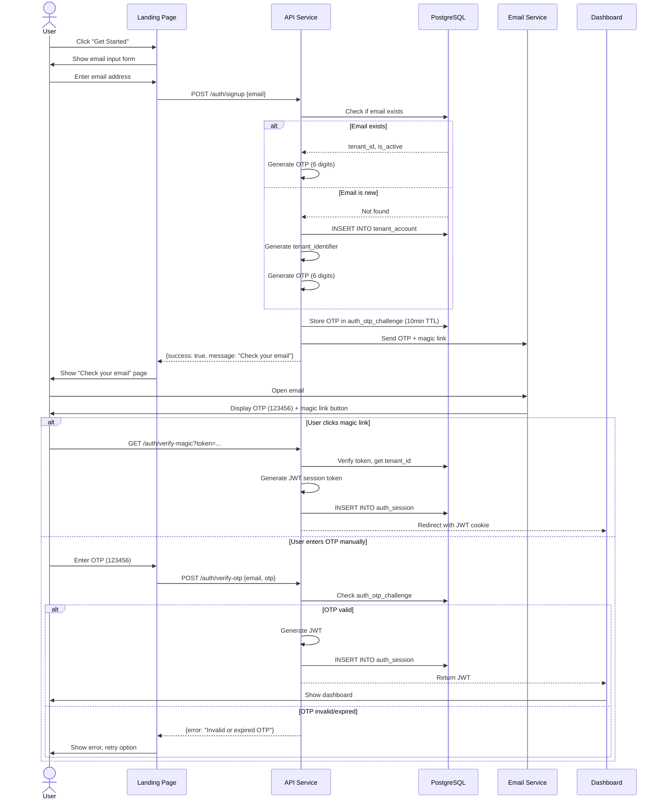
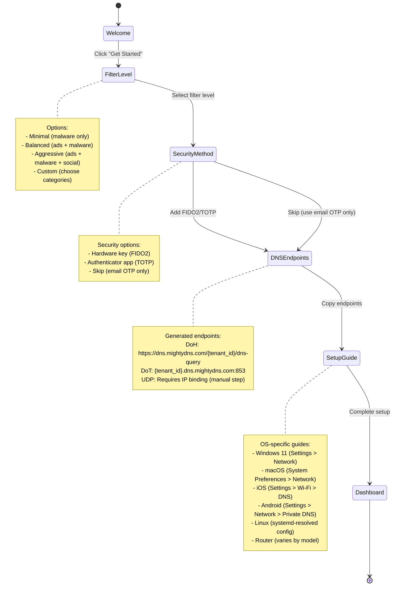
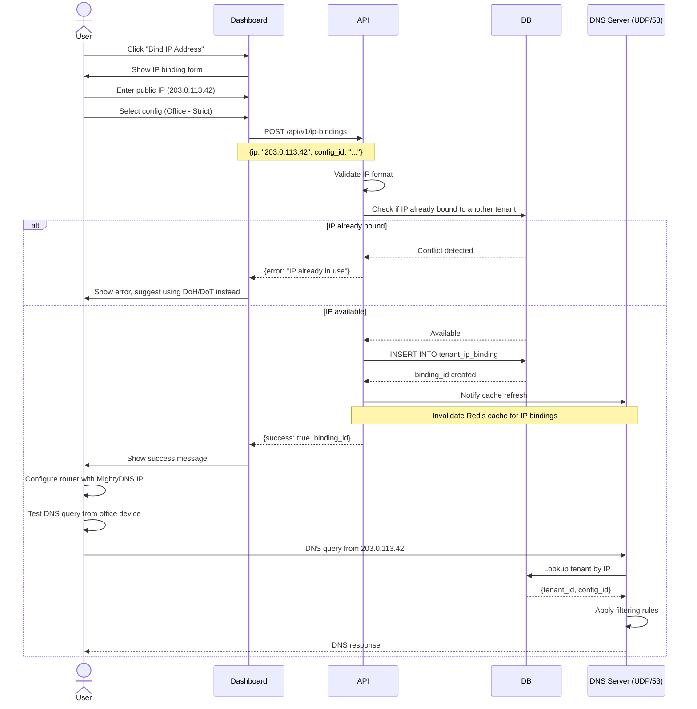
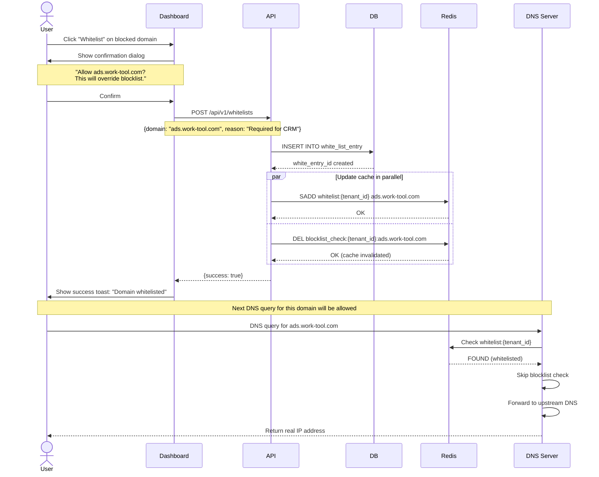
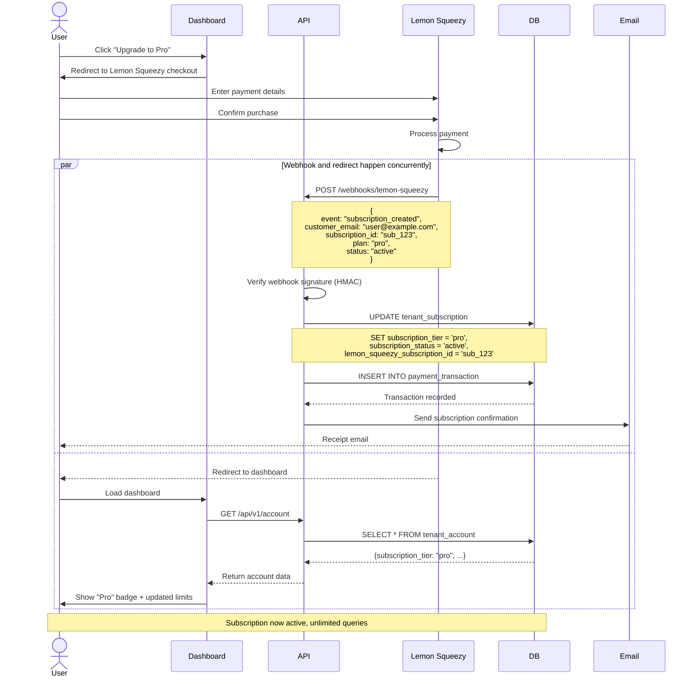

# User Journey Document
## MightyDNS - User Experience Flows

**Version:** 1.0
**Last Updated:** 2025-10-22
**Status:** Draft

---

## 1. Overview

This document maps the complete user experience for MightyDNS, from initial discovery to daily usage. It covers all major user flows including onboarding, authentication, DNS configuration, content filtering management, and billing.

---

## 2. User Personas

### 2.1 Primary Personas

#### Persona 1: Privacy-Conscious Individual ("Privacy Pete")
- **Age:** 28
- **Occupation:** Software Developer
- **Technical Level:** High
- **Goals:**
  - Block ads and trackers across all devices
  - Maintain privacy without VPN overhead
  - Have granular control over filtering rules
- **Pain Points:**
  - Existing DNS services are slow or unreliable
  - Limited customization options
  - Concerns about DNS provider logging queries

#### Persona 2: Parent Administrator ("Parent Paula")
- **Age:** 42
- **Occupation:** Marketing Manager
- **Technical Level:** Medium
- **Goals:**
  - Protect children from inappropriate content
  - Simple setup on family devices
  - Monitor what's being blocked (without invasive logging)
- **Pain Points:**
  - Kids know how to bypass DNS settings
  - Difficult to manage multiple devices
  - Too many false positives with existing solutions

#### Persona 3: Small Business IT Admin ("Admin Alex")
- **Age:** 35
- **Occupation:** IT Administrator
- **Technical Level:** High
- **Goals:**
  - Network-wide malware protection
  - Compliance with security policies
  - Minimal maintenance overhead
- **Pain Points:**
  - Enterprise DNS solutions are expensive
  - Need to justify ROI to management
  - Requires detailed usage reports

---

## 3. User Journey Maps

### 3.1 Journey Stage 1: Discovery & Signup

```
┌─────────────────────────────────────────────────────────────────────┐
│                    STAGE 1: DISCOVERY & SIGNUP                      │
└─────────────────────────────────────────────────────────────────────┘

User Actions              Touchpoints           System Response        User Emotions
─────────────────────────────────────────────────────────────────────────────────
1. Searches Google for    → Landing Page       → Show value prop,      😐 Curious
   "ad blocking DNS"                              comparison chart

2. Reads feature list     → Features Page      → Highlight privacy,    🙂 Interested
                                                  speed, customization

3. Clicks "Get Started"   → Signup Form        → Email input only      😊 Relieved
                                                  (no password!)         (simple signup)

4. Enters email           → Email Sent         → Send 6-digit OTP      ⏳ Waiting
   pete@example.com                               & magic link

5. Checks email           → Email Inbox        → Opens email,          😊 Confident
                                                  clicks magic link

6. Redirected to app      → Dashboard          → Show onboarding       😃 Excited
                                                  wizard
```

#### Detailed Flow: Email Signup



#### Success Criteria
- ✅ User receives email within 30 seconds
- ✅ OTP works on first try (99% success rate)
- ✅ Magic link redirects to dashboard without errors
- ✅ Entire signup process takes <2 minutes

#### Pain Points & Mitigations
| Pain Point | Mitigation |
|------------|-----------|
| Email doesn't arrive | Show "Didn't receive email?" link after 60s, allow resend |
| OTP expires before user enters it | 10-minute expiry (generous), show countdown timer |
| User closes browser after clicking magic link | JWT stored in HTTP-only cookie (persistent) |

---

### 3.2 Journey Stage 2: Onboarding Wizard

```
┌─────────────────────────────────────────────────────────────────────┐
│                   STAGE 2: ONBOARDING WIZARD                        │
└─────────────────────────────────────────────────────────────────────┘

Step    Screen                Action                    System Response
─────────────────────────────────────────────────────────────────────────
1/5     Welcome               Click "Get Started"       → Show benefits recap

2/5     Choose Filter Level   Select "Balanced"         → Enable default
                             (ads + malware)              block categories

3/5     Add Security Method   Choose FIDO2 or Skip     → Register WebAuthn
                                                          or continue

4/5     Get DNS Endpoints     Copy DoH URL             → Generate tenant URLs:
                                                          DoH: https://dns.mightydns.com/abc123/dns-query
                                                          DoT: abc123.dns.mightydns.com:853
                                                          UDP: 1.2.3.4 (bound IP)

5/5     Setup Instructions    Choose device type       → Show OS-specific guide
                             (Windows/macOS/iOS/etc)

Done    Dashboard             View stats               → Show live query counter
```

#### Detailed Flow: Onboarding Wizard



#### Success Criteria
- ✅ 90% of users complete onboarding wizard
- ✅ DNS configuration verified within 5 minutes
- ✅ First blocked query appears in dashboard within 10 minutes

---

### 3.3 Journey Stage 3: DNS Configuration

```
┌─────────────────────────────────────────────────────────────────────┐
│                  STAGE 3: DNS CONFIGURATION                         │
└─────────────────────────────────────────────────────────────────────┘

Scenario 1: Browser Setup (Chrome/Firefox/Edge)
──────────────────────────────────────────────────────────────────────
User: Paula (Parent, configuring Chrome for kids)

1. Copy DoH URL from dashboard
   → https://dns.mightydns.com/xyz789/dns-query

2. Open Chrome Settings
   → Navigate to Privacy & Security > Security

3. Find "Use secure DNS" section
   → Select "With: Custom"

4. Paste DoH URL
   → Chrome validates URL format

5. Click Save
   → Chrome immediately starts using MightyDNS

6. Verify in dashboard
   → See "Chrome on Windows" appear in device list


Scenario 2: iOS Device Setup
──────────────────────────────────────────────────────────────────────
User: Pete (Privacy user, configuring iPhone)

1. Download configuration profile from dashboard
   → Click "Download iOS Profile"

2. iOS prompts to install profile
   → Open Settings app, see "Profile Downloaded"

3. Navigate to Settings > General > VPN & Device Management
   → Tap on "MightyDNS Configuration Profile"

4. Tap Install
   → Enter device passcode

5. Confirm installation
   → Profile installed, DoT endpoint configured

6. Verify connection
   → Dashboard shows "iPhone" device active


Scenario 3: Router Setup (Network-wide)
──────────────────────────────────────────────────────────────────────
User: Alex (IT Admin, configuring office network)

1. Login to router admin panel
   → Navigate to DNS settings

2. Change Primary DNS to MightyDNS IP
   → Need static IP binding for UDP/53

3. In MightyDNS dashboard, bind office public IP
   → Click "Bind IP Address"
   → Enter public IP: 203.0.113.42
   → Select config: "Office Network - Strict"

4. Save router settings
   → All devices on network now use MightyDNS

5. Test DNS resolution
   → Run `nslookup ads.example.com`
   → Verify NXDOMAIN response

6. Monitor dashboard
   → See query count spike as all office devices connect
```

#### Detailed Flow: IP Binding for UDP/53



---

### 3.4 Journey Stage 4: Daily Usage

```
┌─────────────────────────────────────────────────────────────────────┐
│                     STAGE 4: DAILY USAGE                            │
└─────────────────────────────────────────────────────────────────────┘

Morning: Check Dashboard
──────────────────────────────────────────────────────────────────────
User: Paula checks what was blocked overnight

1. Login to dashboard (using saved session)
   → JWT auto-renewed, no re-authentication needed

2. View "Last 24 Hours" summary
   → 1,247 queries
   → 89 blocked (7.1%)
   → Top blocked: ads.example.com (12 hits)

3. Notice unusual domain
   → "cdn.sketchy-site.com" blocked 5 times

4. Click domain to see details
   → Blocked by category: "malware_phishing"
   → Device: "Kid's iPad"
   → Timestamps: 11:32 PM (when kids should be asleep!)

5. Add parental note
   → "Check with kids about late-night browsing"


Afternoon: Whitelist False Positive
──────────────────────────────────────────────────────────────────────
User: Alex discovers work tool is broken due to blocking

1. Employee reports "CRM won't load"

2. Alex checks MightyDNS dashboard
   → Filters query log for "crm"

3. Finds blocked domain
   → "analytics.crm-vendor.com"
   → Category: "tracking_telemetry"

4. Clicks "Whitelist" button
   → Confirm: "Allow analytics.crm-vendor.com for Office config?"

5. Whitelist immediately applied
   → Redis cache updated in <1 second
   → No restart required

6. Employee confirms CRM working
   → Alex adds note: "CRM analytics endpoint - required"


Evening: Configure New Device
──────────────────────────────────────────────────────────────────────
User: Pete sets up new laptop

1. Opens MightyDNS dashboard on new laptop

2. Navigates to "Devices & Setup"
   → Click "Add Device"

3. Selects "Linux Desktop"
   → Shows systemd-resolved configuration

4. Copies commands to terminal:
   ```bash
   sudo mkdir -p /etc/systemd/resolved.conf.d/
   echo "[Resolve]
   DNS=1.2.3.4
   DNSOverTLS=yes
   Domains=~." | sudo tee /etc/systemd/resolved.conf.d/mightydns.conf
   sudo systemctl restart systemd-resolved
   ```

5. Verifies connection
   → Dashboard shows "Linux Desktop" device appear
   → Green checkmark: "Connected"

6. Tests blocking
   → Visits known ad-heavy website
   → Sees blocked ad count increment in dashboard
```

#### Detailed Flow: Whitelisting Domain



---

### 3.5 Journey Stage 5: Subscription Management

```
┌─────────────────────────────────────────────────────────────────────┐
│                 STAGE 5: SUBSCRIPTION MANAGEMENT                    │
└─────────────────────────────────────────────────────────────────────┘

Trigger: Free Tier Limit Reached
──────────────────────────────────────────────────────────────────────
User: Paula hits 300K queries/month limit

1. Dashboard shows banner
   → "⚠️ 95% of free tier limit used (285,000/300,000 queries)"

2. Clicks "Upgrade to Pro"
   → Redirected to pricing page

3. Reviews plan comparison
   Free           Pro ($4.99/mo)    Family ($9.99/mo)
   ───────────────────────────────────────────────────────────
   300K queries   Unlimited         Unlimited
   1 config       10 configs        10 configs × 5 accounts
   Email OTP      + FIDO2/TOTP      + FIDO2/TOTP
   7-day logs     90-day logs       90-day logs
   -              Priority support  Priority support + Family sharing

4. Selects "Family Plan"
   → Click "Subscribe"

5. Lemon Squeezy checkout opens (overlay)
   → Enter payment details (card/PayPal/Google Pay)
   → Email: paula@example.com (pre-filled)
   → Price: $9.99/month (billed monthly)

6. Confirms payment
   → Lemon Squeezy processes payment

7. Redirected back to dashboard
   → Subscription immediately active
   → "Family" badge appears in header
   → Usage limit removed


Managing Family Accounts
──────────────────────────────────────────────────────────────────────
User: Paula adds husband's account to Family plan

1. Navigate to Settings > Family Sharing
   → Click "Invite Member"

2. Enter husband's email
   → husband@example.com

3. Invitation sent
   → Husband receives email with invite link

4. Husband clicks link
   → Creates account (email OTP flow)
   → Automatically linked to Paula's subscription

5. Husband configures his devices
   → Gets own tenant_identifier (separate DoH/DoT endpoints)
   → Shares subscription billing, but separate filtering configs

6. Paula monitors family usage
   → Dashboard shows aggregate stats
   → Can view per-member breakdowns


Downgrade Scenario
──────────────────────────────────────────────────────────────────────
User: Alex's company decides to cancel subscription

1. Navigate to Settings > Billing
   → Click "Manage Subscription"

2. Lemon Squeezy customer portal opens
   → Shows current plan: Business ($49/mo)
   → Next billing date: 2025-11-15

3. Click "Cancel Subscription"
   → Lemon Squeezy asks for feedback (optional)

4. Confirm cancellation
   → "Subscription will remain active until 2025-11-15"
   → After that, account reverts to Free tier

5. Receives confirmation email
   → Summary of cancellation
   → Data export link (GDPR compliance)

6. After subscription expires
   → Dashboard shows "Free" tier
   → Query logs retained for 7 days only (down from 90)
   → Configs reduced to 1 (oldest configs deactivated)
```

#### Detailed Flow: Lemon Squeezy Webhook Integration



---

### 3.6 Journey Stage 6: Advanced Configuration

```
┌─────────────────────────────────────────────────────────────────────┐
│                 STAGE 6: ADVANCED CONFIGURATION                     │
└─────────────────────────────────────────────────────────────────────┘

Scenario 1: Multiple Configs (Pro/Family tier)
──────────────────────────────────────────────────────────────────────
User: Pete (Privacy user) wants different rules for work vs personal

1. Navigate to Configs > Create New
   → Enter name: "Work - Permissive"
   → Description: "Allow all domains for work compliance"

2. Configure blocklist categories
   → Enable: Malware, Phishing
   → Disable: Ads, Tracking, Social Media

3. Save config
   → New DNS endpoints generated:
     DoH: https://dns.mightydns.com/abc123-work/dns-query
     DoT: abc123-work.dns.mightydns.com:853

4. Configure work laptop to use work endpoint
   → Set DoH URL in Chrome

5. Configure personal laptop to use default config
   → Set DoH URL with original endpoint

6. Verify in dashboard
   → Two devices listed with different configs
   → Work Laptop: "Work - Permissive"
   → Personal Laptop: "Default - Balanced"


Scenario 2: Custom Blocklist Import
──────────────────────────────────────────────────────────────────────
User: Alex wants to import company-specific blocklist

1. Navigate to Blocklists > Custom Domains
   → Click "Import Domains"

2. Upload CSV file
   ads.competitor-site.com,advertising
   analytics.competitor-site.com,tracking
   social.competitor-site.com,social_media
   malware-example.com,malware_phishing

3. Review import preview
   → 4 domains to be added
   → Duplicate check: 0 duplicates found

4. Confirm import
   → Domains added to config-specific custom blocklist

5. Test blocking
   → Try visiting ads.competitor-site.com
   → Verify NXDOMAIN response

6. Export for backup
   → Click "Export Blocklist"
   → Download CSV with all custom + global blocked domains


Scenario 3: Scheduled Filtering Rules
──────────────────────────────────────────────────────────────────────
User: Paula wants to block social media only during school hours

NOTE: This feature is in the roadmap but not in v1.0
Future implementation:

1. Navigate to Config > Scheduling (Pro feature)
   → Click "Add Schedule Rule"

2. Configure time-based rule
   → Name: "School Hours Social Block"
   → Days: Monday - Friday
   → Time: 8:00 AM - 3:00 PM
   → Action: Enable "social_media" category

3. Save rule
   → Backend creates pg_cron job to toggle category

4. Rule activates at 8:00 AM on weekdays
   → Instagram, TikTok, Facebook blocked
   → Kids' devices can't access during school

5. Rule deactivates at 3:00 PM
   → Social media allowed after school
```

---

## 4. Error States & Recovery

### 4.1 Common Error Scenarios

```
┌─────────────────────────────────────────────────────────────────────┐
│                         ERROR SCENARIOS                             │
└─────────────────────────────────────────────────────────────────────┘

Error 1: DNS Not Resolving
──────────────────────────────────────────────────────────────────────
Symptom: User visits website, gets "can't resolve DNS" error

Diagnosis Flow:
1. Dashboard shows "Last query: 10 minutes ago" (stale)
2. User clicks "Test DNS Connection" button
3. System runs diagnostic:
   → Test query to known domain (example.com)
   → Check if query appears in logs
   → Measure latency

Possible Causes & Solutions:
a) DNS endpoints not configured correctly
   → Show setup guide again with video tutorial

b) Firewall blocking DoH/DoT ports
   → Suggest trying different protocol (DoH vs DoT vs UDP)

c) MightyDNS service outage
   → Show status page: status.mightydns.com
   → Display incident details and ETA


Error 2: False Positive Blocking
──────────────────────────────────────────────────────────────────────
Symptom: Legitimate website is blocked

User Journey:
1. User tries to access bank.example.com
2. Gets NXDOMAIN or blank page

3. User suspects DNS blocking
   → Opens MightyDNS dashboard
   → Searches query log for "bank.example.com"

4. Finds blocked entry
   → Category: "malware_phishing" (false positive!)
   → Source: "OISD Big" blocklist

5. User clicks "Report False Positive"
   → Modal opens: "This will:
      1. Whitelist domain for you immediately
      2. Report to blocklist maintainer (OISD)
      3. Help improve MightyDNS AI whitelist"

6. User confirms
   → Domain immediately whitelisted
   → Background job notifies OISD via GitHub issue
   → ML model updated to prevent similar false positives


Error 3: Session Expired
──────────────────────────────────────────────────────────────────────
Symptom: User tries to access dashboard, gets logged out

Flow:
1. User clicks dashboard link (saved in bookmarks)
2. JWT cookie expired (1-hour TTL)

3. Backend returns 401 Unauthorized
   → Frontend detects auth error

4. User redirected to login page
   → Email pre-filled (from expired JWT)
   → Message: "Your session expired. Please log in again."

5. User clicks "Send Magic Link"
   → OTP sent to email

6. User authenticates
   → Redirected back to original URL (deep link preserved)


Error 4: Payment Failure
──────────────────────────────────────────────────────────────────────
Symptom: Credit card declined during subscription renewal

Flow:
1. Lemon Squeezy attempts to charge card
   → Payment fails (insufficient funds)

2. Lemon Squeezy sends webhook to MightyDNS
   → event: "subscription_payment_failed"

3. Backend updates subscription status
   → subscription_status = 'suspended'

4. User sees banner on next dashboard visit
   → "⚠️ Payment failed. Please update payment method."

5. User clicks "Update Payment"
   → Redirected to Lemon Squeezy customer portal

6. User updates card
   → Lemon Squeezy retries charge automatically

7. Payment succeeds
   → Webhook: "subscription_payment_succeeded"
   → subscription_status = 'active'
   → User receives confirmation email
```

---

## 5. Accessibility Considerations

### 5.1 WCAG 2.1 AA Compliance

| Guideline | Implementation | User Benefit |
|-----------|----------------|--------------|
| **Keyboard Navigation** | All buttons/forms accessible via Tab/Enter | Users with motor disabilities can navigate without mouse |
| **Screen Reader Support** | ARIA labels on all interactive elements | Blind users can use dashboard with NVDA/JAWS |
| **Color Contrast** | 4.5:1 minimum for text, 3:1 for UI components | Users with low vision can read content |
| **Text Resize** | Layout responsive up to 200% zoom | Users with vision impairments can enlarge text |
| **Focus Indicators** | Visible focus ring on all interactive elements | Users can see where they are on the page |

### 5.2 Mobile Responsiveness

```
Desktop (1920×1080)         Tablet (768×1024)          Mobile (375×667)
─────────────────────────────────────────────────────────────────────
┌─────────────────────┐     ┌──────────────┐          ┌─────────┐
│ Header + Nav        │     │ Header       │          │ Header  │
│─────────────────────│     │──────────────│          │─────────│
│ Sidebar │ Main      │     │ Main Content │          │ Content │
│ Nav     │ Content   │     │              │          │         │
│         │           │     │              │          │         │
│         │ Stats     │     │ Stats        │          │ Stats   │
│         │ ┌───┬───┐ │     │ ┌─────────┐  │          │ Stack   │
│         │ │   │   │ │     │ │ Stacked │  │          │ Blocks  │
│         │ └───┴───┘ │     │ └─────────┘  │          │         │
└─────────────────────┘     └──────────────┘          └─────────┘

- Sidebar collapses to hamburger menu on mobile
- Charts stack vertically on narrow screens
- Tables scroll horizontally or switch to card view
```

---

## 6. User Success Metrics

### 6.1 Onboarding Success

| Metric | Target | Measurement |
|--------|--------|-------------|
| **Signup Completion Rate** | >80% | % of users who complete email verification |
| **Onboarding Wizard Completion** | >70% | % of users who finish all 5 steps |
| **DNS Configuration Verification** | >60% | % of users who successfully configure DNS within 24 hours |
| **First Query Within 1 Hour** | >50% | % of users who send first DNS query within 1 hour of signup |

### 6.2 Engagement Metrics

| Metric | Target | Measurement |
|--------|--------|-------------|
| **Daily Active Users (DAU)** | 30% of signups | % of users who visit dashboard daily |
| **Weekly Active Users (WAU)** | 60% of signups | % of users who visit dashboard weekly |
| **Avg Queries Per User** | 1000/day | Total queries / active users |
| **Blocklist Customization Rate** | >40% | % of users who add whitelist or custom blocks |

### 6.3 Conversion & Retention

| Metric | Target | Measurement |
|--------|--------|-------------|
| **Free → Pro Conversion** | >5% | % of free users who upgrade within 90 days |
| **Churn Rate (Monthly)** | <3% | % of paid users who cancel per month |
| **Net Promoter Score (NPS)** | >50 | Survey: "How likely to recommend MightyDNS?" |
| **Customer Lifetime Value (LTV)** | >$100 | Avg revenue per user over lifetime |

---

## 7. Support & Troubleshooting

### 7.1 Self-Service Help Center

```
Help Center Topics:
────────────────────────────────────────────────────────────────
1. Getting Started
   - What is DNS filtering?
   - How does MightyDNS work?
   - Setting up your first device

2. Configuration Guides
   - Windows 10/11 setup
   - macOS setup
   - iOS/iPadOS setup
   - Android setup
   - Router setup
   - Browser-specific setup (Chrome, Firefox, Edge, Safari)

3. Troubleshooting
   - DNS not resolving
   - Slow internet after setup
   - Can't access specific website
   - How to whitelist a domain

4. Account & Billing
   - How to upgrade/downgrade
   - Payment methods
   - Refund policy
   - Cancelling subscription

5. Privacy & Security
   - What data does MightyDNS log?
   - How long are logs retained?
   - GDPR data export
   - Deleting your account
```

### 7.2 In-App Contextual Help

```
Dashboard tooltips:
───────────────────────────────────────────────────────────────
Hover over "Blocked Queries" chart
→ Tooltip: "Domains blocked by your filtering rules. Click any bar to see blocked domains for that hour."

Click "?" icon next to "DoH URL"
→ Modal: "DNS over HTTPS (DoH) encrypts your DNS queries. Copy this URL and paste it into your browser or OS DNS settings. Learn more →"

Empty state: No queries yet
→ Message: "No queries detected yet. Make sure you've configured DNS on at least one device. Need help? View setup guide →"
```

---

## 8. Future Enhancements (Roadmap)

```
Q1 2026: Mobile Apps
─────────────────────────────────────────────────────────────────
- Native iOS app with VPN-based DNS filtering
- Native Android app with Private DNS integration
- Push notifications for threat alerts

Q2 2026: Parental Controls Dashboard
─────────────────────────────────────────────────────────────────
- Per-device screen time tracking
- Scheduled filtering rules (block social media during school hours)
- Content category reports with thumbnails

Q3 2026: Enterprise Features
─────────────────────────────────────────────────────────────────
- SSO integration (SAML, OAuth)
- Role-based access control (admin, user, viewer)
- Audit logs with compliance reports
- Custom SLA with guaranteed uptime

Q4 2026: AI-Powered Features
─────────────────────────────────────────────────────────────────
- Automatic false-positive detection and whitelisting
- Anomaly detection (alert on unusual DNS patterns)
- Natural language blocklist queries ("Block all gambling sites")
```

---

**Document Control:**
- **Next Review Date:** 2025-11-22
- **Distribution:** Product, Engineering, Design teams
- **Classification:** Internal
